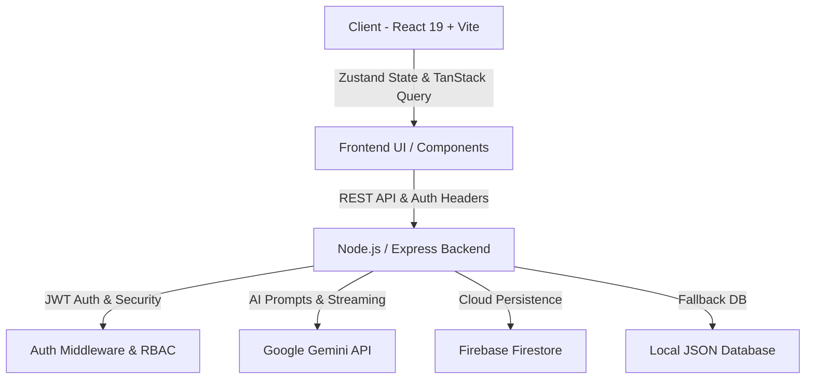

# 🌌 FuturoVerse — Next-Gen AI-Powered Educational Ecosystem

<div align="center">


[](https://react.dev/)
[](https://www.typescriptlang.org/)
[](https://vitejs.dev/)
[](https://tailwindcss.com/)
[](https://ai.google.dev/)
[](https://firebase.google.com/)
[](LICENSE)

<p align="center">
  <strong>An intelligent, bilingual LMS and AI learning companion designed to empower students, educators, and academic institutions with generative AI, automated assessment, and real-time learning analytics.</strong>
</p>

[Key Features](#-key-features) • [Architecture](#-architecture) • [Tech Stack](#-tech-stack) • [Quick Start](#-quick-start) • [Role Capabilities](#-role-based-access--workflows) • [Author](#-author)

</div>

---

## 📖 Table of Contents

- [Overview](#-overview)
- [Key Features](#-key-features)
  - [🤖 Intelligent AI Learning Suite](#-intelligent-ai-learning-suite)
  - [📝 Interactive Quiz & Assessment Engine](#-interactive-quiz--assessment-engine)
  - [📊 Deep Learning Analytics & Gradebook](#-deep-learning-analytics--gradebook)
  - [🌐 Bilingual & Localized Experience](#-bilingual--localized-experience)
  - [🛡️ Role-Based Access Control (RBAC)](#-role-based-access-control-rbac)
- [System Architecture](#-system-architecture)
- [Technology Stack](#-technology-stack)
- [Getting Started](#-getting-started)
  - [Prerequisites](#prerequisites)
  - [Installation](#installation)
  - [Environment Configuration](#environment-configuration)
  - [Running the Development Server](#running-the-development-server)
  - [Production Build](#production-build)
- [Directory Structure](#-directory-structure)
- [Role-Based Access & Workflows](#-role-based-access--workflows)
- [Author](#-author)
- [License](#-license)

---

## 🌟 Overview

**FuturoVerse** is a modern educational platform engineered to bridge pedagogical needs with cutting-edge artificial intelligence. Built specifically with localized curriculum support in mind, it provides seamless multilingual capability (English and Urdu), dynamic AI-assisted study tools, real-time analytics, automated quiz generation, and enterprise-grade role-based access.

Whether you are a **Student** seeking interactive study guides and instant AI tutoring, a **Teacher** crafting automated quizzes and tracking class performance, or an **Administrator** analyzing institution-wide telemetry, FuturoVerse delivers a frictionless, hyper-modern experience.

---

## ✨ Key Features

### 🤖 Intelligent AI Learning Suite
Powered by Google Gemini 2.5 Models via `@google/genai`:
- **🎙️ AI Voice Learning Companion**: Hands-free real-time conversational audio tutor with speech recognition, natural voice synthesis in English & Urdu (`ur-PK`), and an animated glowing audio waveform visualizer.
- **📸 Multimodal AI Vision Problem Solver**: Upload handwritten math equations, calculus integrals, or physics diagrams for instant step-by-step LaTeX derivations and practice challenges with 1-click presentation demos.
- **🧠 Interactive Mind Map & Concept Tree Studio**: Visual hierarchical concept topology graph with interactive node dossiers, governing mathematical formulas, and 1-question verification drills.
- **Executive Summaries**: Transform dense course lectures into crystal-clear study summaries.
- **AI Practice Quizzes**: Generate contextual multiple-choice and short-answer quizzes from uploaded documents.
- **Homework & Assignment Creator**: Build structured assignments with grading rubrics in seconds.
- **Active Flashcards**: Spaced-repetition friendly concept cards for rapid revision.
- **Solved Practice & Drills**: Step-by-step mathematical, algorithmic, and theoretical problem solutions.
- **Interactive Chat Assistant**: Real-time contextual Q&A with document upload support and markdown rendering.

### 📝 Interactive Quiz & Assessment Engine
- **⚔️ Gamified 1v1 AI Battle Arena**: Live speed duel quiz against adaptive AI opponents with round timers, streak combos (2x, 3x multipliers), score races, and mastery XP rewards.
- **Live Quiz Player**: Clean, distraction-free student testing environment with timers, anti-cheat proctoring logs, and instant scoring.
- **AI-Powered & Manual Quiz Builder**: Teachers can create quizzes either via instant AI generation or with the custom question editor.
- **Automated Explanations**: Immediate, step-by-step reasoning for both correct and incorrect answers.
- **Export to PDF**: Generate polished assessment sheets and solution keys with one click using `jspdf`.

### 📊 Deep Learning Analytics & Gradebook
- **Interactive Visualizations**: Powered by `recharts` for progress tracking, score trends, attendance metrics, and topic mastery.
- **Comprehensive Gradebook**: Centralized grade management with student breakdown, weighting, and performance flags.
- **Engagement Heatmaps**: Track student activity, assignment completion velocity, and areas requiring remediation.

### 🌐 Bilingual & Localized Experience
- **English & Urdu Support**: Full bidirectional localization (LTR/RTL) with optimized typography.
- **Tailored Context**: Designed for academic syllabi and regional examination patterns.

### 🛡️ Role-Based Access Control (RBAC)
- **Role Scopes**: Tailored navigation and protected screens for **Student**, **Teacher**, **Administrator**, and **Guest**.
- **Secure Authentication**: JWT session handling, hashed passwords (`bcryptjs`), and Firestore / JSON dual-mode data persistence.

---

## 🏗️ System Architecture



---

## 🛠️ Technology Stack

| Layer | Technology |
|---|---|
| **Frontend Framework** | [React 19](https://react.dev/) + [TypeScript](https://www.typescriptlang.org/) |
| **Build & Tooling** | [Vite 6](https://vitejs.dev/) + [ESBuild](https://esbuild.github.io/) + [TSX](https://github.com/privatenumber/tsx) |
| **Styling & Design** | [Tailwind CSS v4](https://tailwindcss.com/) + Glassmorphism + Modern Dark/Light Themes |
| **State Management** | [Zustand](https://github.com/pmndrs/zustand) + [TanStack React Query v5](https://tanstack.com/query) |
| **AI Integration** | [Google Gen AI SDK (`@google/genai`)](https://www.npmjs.com/package/@google/genai) |
| **Backend & Server** | [Express](https://expressjs.com/) + [TypeScript](https://www.typescriptlang.org/) |
| **Database & Cloud** | [Firebase Admin SDK](https://firebase.google.com/) (Firestore) + JSON Storage |
| **Security** | [JSON Web Tokens (JWT)](https://jwt.io/) + [BcryptJS](https://github.com/dcodeIO/bcrypt.js) + [Cookie Parser](https://github.com/expressjs/cookie-parser) |
| **Data Visualization** | [Recharts](https://recharts.org/) |
| **Icons & Animation** | [Lucide React](https://lucide.dev/) + [Motion](https://motion.dev/) |
| **Document Export** | [jsPDF](https://github.com/parallax/jsPDF) |

---

## 🚀 Getting Started

### Prerequisites
- **Node.js**: v18.0.0 or higher
- **npm** or **bun** / **yarn**
- **Google Gemini API Key**: [Get a Gemini API key here](https://aistudio.google.com/)

### Installation

1. **Clone the repository:**
   ```bash
   git clone https://github.com/muhammadayantoorie-creator/FuturoVerse.git
   cd FuturoVerse
   ```

2. **Install dependencies:**
   ```bash
   npm install
   ```

### Environment Configuration

Create a `.env` file in the root directory (or copy from `.env.example`):

```env
# Gemini AI Configuration
GEMINI_API_KEY=your_gemini_api_key_here

# Server Configuration
PORT=3000
JWT_SECRET=your_super_secret_jwt_key_here

# Firebase (Optional / Pre-configured in firebase-applet-config.json)
FIREBASE_PROJECT_ID=your_project_id
```

### Running the Development Server

Start the full-stack application (Express API + Vite Frontend):

```bash
npm run dev
```

The application will be accessible at: `http://localhost:3000`

### Production Build

```bash
# Build the client and bundle the server
npm run build

# Start the production server
npm start
```

---

## 📁 Directory Structure

```plaintext
FuturoVerse/
├── src/
│   ├── components/
│   │   ├── shared/         # Common layout, buttons, notification, inputs
│   │   └── ui/             # Design system components (Accordion, Dialog, Drawer, etc.)
│   ├── config/             # i18n translations & localization configs
│   ├── features/
│   │   ├── ai-tools/       # Gemini AI workspace, chat assistant & prompt pipelines
│   │   ├── analytics/      # Recharts-powered telemetry and performance metrics
│   │   ├── auth/           # Login, registration, role selection & JWT management
│   │   ├── classes/        # Class management, schedules & student rosters
│   │   ├── dashboard/      # Role-specific operational dashboards
│   │   ├── gradebook/      # Grades, assignment feedback & evaluation sheets
│   │   ├── help/           # Knowledge base & FAQs
│   │   ├── landing/        # High-impact landing page & feature showcases
│   │   ├── quizzes/        # Interactive quiz engine, builder & PDF exporter
│   │   ├── resources/      # Digital library & curriculum assets
│   │   └── settings/       # Profile, security & system preferences
│   ├── lib/                # API clients, Firebase helpers & utilities
│   ├── store/              # Zustand global application state
│   ├── types/              # Global TypeScript interfaces & schemas
│   ├── utils/              # PDF export helpers & data formatting
│   ├── App.tsx             # Root application router & RBAC guards
│   ├── index.css           # Tailwind CSS tokens & global design system
│   └── main.tsx            # React application entry point
├── server.ts               # Express API backend & Gemini AI orchestration
├── firebase.json           # Firebase configuration
├── firestore.rules         # Security rules for Cloud Firestore
├── tsconfig.json           # TypeScript configuration
├── vite.config.ts          # Vite build configuration
└── package.json            # Project dependencies and npm scripts
```

---

## 👥 Role-Based Access & Workflows

| Feature | Student | Teacher | Administrator | Guest |
|---|:---:|:---:|:---:|:---:|
| **Landing & Product Tour** | ✅ | ✅ | ✅ | ✅ |
| **Interactive AI Study Tools** | ✅ | ✅ | ✅ | Limited Demo |
| **Take Quizzes & Practice** | ✅ | ✅ | ✅ | Demo |
| **Create Quizzes (Manual / AI)** | ❌ | ✅ | ✅ | ❌ |
| **Class Schedule & Materials** | ✅ | ✅ | ✅ | View-only |
| **Gradebook & Evaluations** | ❌ | ✅ | ✅ | ❌ |
| **Institutional Analytics** | ❌ | ❌ | ✅ | ❌ |
| **System Settings** | ❌ | ❌ | ✅ | ❌ |

---

## 👨‍💻 Author

<div align="center">

### **Muhammad Ayan**
*Creator & Lead Developer of FuturoVerse*

[](https://github.com/muhammadayantoorie-creator)
[](https://github.com/muhammadayantoorie-creator/FuturoVerse)

</div>

---

## 📄 License

This project is licensed under the [Apache License 2.0](LICENSE).
